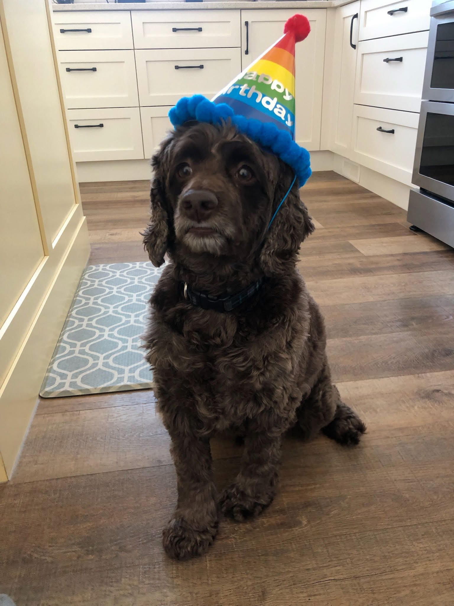

{width=250px}

My name is Ceilidh (pronounced like Kaylee). I am from Calgary, AB. I did my undergraduate degree at the University of Victoria, then worked as a Marketing Software Consultant for 5 years prior to joining the MDS program. I am looking forward to learning more about data science and data analysis in this program. 

Milestone 1 focuses on using the command line to create and manage directories and files. 