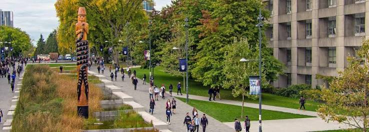

The first couple of weeks in the UBC Master of Data Science program has been a busy but exciting introduction to what the next year will look like. The first week has already involved getting familiar with new tools and workflows, working through course material, and adjusting to the pace of the program. 

One of the biggest takeaways from my first week has been how much there is still to learn. Some of the technical setup has been a learning experience in itself, but I’m starting to feel more comfortable navigating these new environments. I’m looking forward to continuing to develop these skills, meeting more of my classmates, and seeing how much I can learn and accomplish throughout the MDS program.